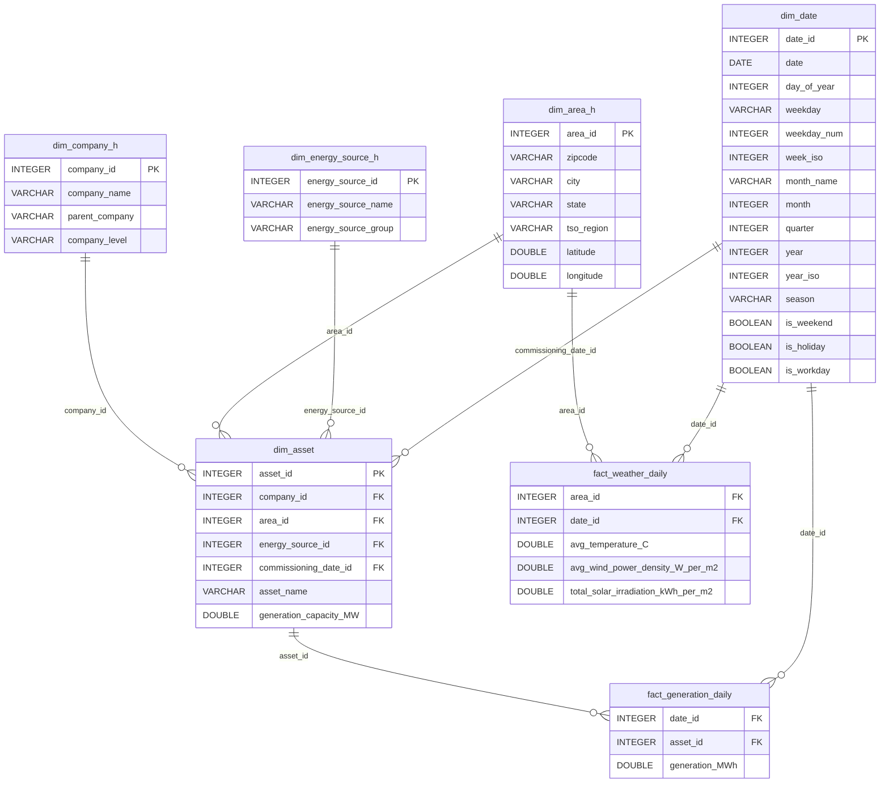
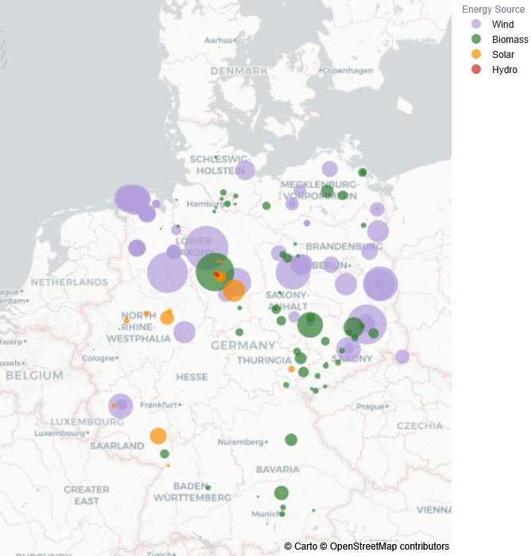

# Renewables-Climate Mart

A synthetic renewable energy data mart for Germany combining renewable generation assets, estimated electricity generation, and weather observations. 

The project builds a star-schema data mart in DuckDB using publicly available data sources, including the German Market Master Data Register (MaStR), SMARD, and Open-Meteo. The resulting dataset can be used for analytical workloads, dashboards and natural-language-to-SQL systems.

## Related Project

This data mart serves as one of the demonstration datasets for a Retrieval-Augmented Generation (RAG) based Natural Language Interface to Databases (NLIDB) developed as part of my master's thesis.

Live Demo:
https://rag-nlidb.streamlit.app/

## Data Model

The mart follows a star-schema design with five dimensions and two fact tables.



### Dimensions

* `dim_company_h`
* `dim_area_h`
* `dim_energy_source_h`
* `dim_date`
* `dim_asset`

### Fact Tables

* `fact_generation_daily`
* `fact_weather_daily`

## Example Analysis

The following analysis was generated from the Renewables-Climate Mart using the related NLIDB prototype.

**Question**

> Map the generation capacity across Germany. Summarize the portfolio by energy source, operator and city. Ensure TSO regions, GPS coordinates and asset counts are included for regional clustering.

**Result**

The query aggregates installed generation capacity from the asset dimension and combines it with company, energy source and geographic area information. The result is visualized by location and energy source to show the regional structure of the renewable portfolio.



## Data Sources

### Renewable Energy Assets

* German Market Master Data Register (MaStR)
* Export date: 2026-01-01
* Used to derive renewable generation assets, installed capacities, operators, and geographic attributes

### Electricity Generation Profiles

* SMARD
* Actual electricity generation by energy source
* Daily aggregation level
* TSO regions: 50Hertz, Amprion, TenneT, and TransnetBW
* Used as generation profiles for distributing annual portfolio generation targets

### Weather Data

* Open-Meteo Archive API
* Temperature (2 m)
* Wind Speed (100 m)
* Shortwave Radiation
* Surface Pressure
* Used to derive daily weather indicators for renewable generation analysis

## Project Structure

```text
notebooks/
├── 01_extract_renewable_assets_from_mastr.ipynb
├── 02_build_dimension_tables.ipynb
├── 03_build_generation_fact_table.ipynb
├── 04_build_weather_fact_table.ipynb
└── 05_load_mart_to_duckdb.ipynb

data/
├── raw/
├── interim/
└── processed/

database/
└── renewables_climate_mart.duckdb
```

## ETL Pipeline

### 01 – Extract Renewable Electricity Generation Units from MaStR

Extracts renewable electricity generation units and relevant market actors from the MaStR export.

### 02 – Build Dimension Tables

Creates the company, area, energy source, date, and asset dimensions used throughout the data mart.

### 03 – Build Daily Generation Fact Table

Generates daily asset-level electricity generation estimates using installed capacity, annual generation targets, and TSO-specific generation profiles.

### 04 – Build Weather Fact Table

Retrieves weather observations from Open-Meteo and aggregates hourly observations into daily weather indicators.

### 05 – Load Mart to DuckDB

Creates the star schema in DuckDB, loads all dimensions and fact tables, validates the resulting mart, and stores the final database instance.

## Reproducibility

A fixed random seed is used during asset-level generation allocation to ensure reproducible results across notebook executions. Running the pipeline multiple times with the same source data will therefore produce identical outputs.

## Requirements

Install the required packages:

```bash
pip install -r requirements.txt
```

## Build the Data Mart

To rebuild the DuckDB mart from the included project data, run:

```bash
python run_pipeline.py
```

To execute the complete pipeline and recreate the data mart from scratch, including MaStR extraction, run:

```bash
python run_full_pipeline.py
```

**Note:** The full pipeline requires external source files that are not included in this repository, including the German Market Master Data Register (MaStR) XML export. These files must be downloaded separately and placed in the appropriate `data/raw/` directories before execution.

## Output

Running the pipeline produces the processed CSV tables and the final DuckDB database.

```text
data/processed/
├── dim_company_h.csv
├── dim_area_h.csv
├── dim_energy_source_h.csv
├── dim_date.csv
├── dim_asset.csv
├── fact_generation_daily.csv
└── fact_weather_daily.csv

database/
└── renewables_climate_mart.duckdb
```

The DuckDB database contains the complete Renewables-Climate Mart and can be queried directly using DuckDB, Python, BI tools, or natural-language-to-SQL systems.
